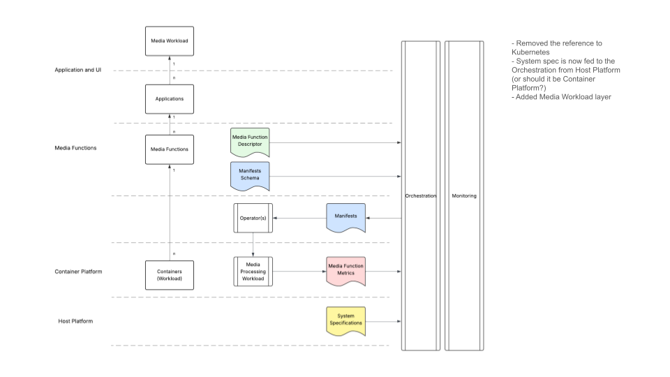
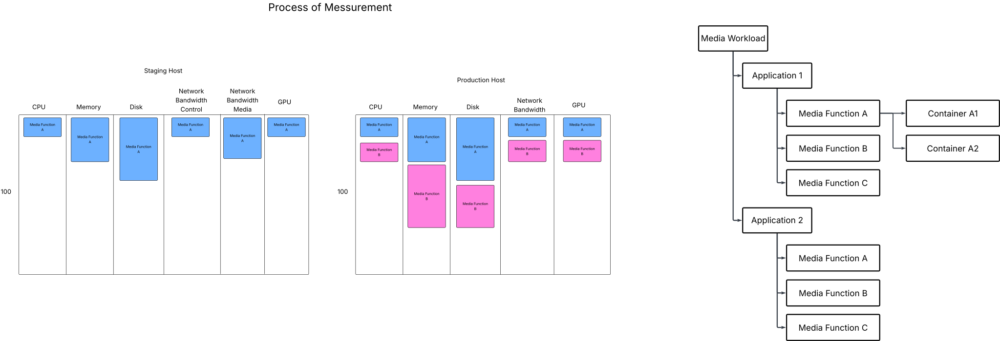

# Media function deployment workflow

## Overview

This document describes the deployment workflow for media functions in a container orchestration environment. The system uses declarative resource manifests to describe media processing requirements and handles the deployment, scaling, and resource management of media workloads. This solution is designed as part of the recommended practices for building a Dynamic Media Facility, aligning with the Media Function Orchestration principles outlined in the EBU White Paper "The Dynamic Media Facility Reference Architecture Document."

## Business Drivers and Design Goals

This media function deployment workflow addresses critical user requirements for modern media facility operations:

**User Stories Addressed:**

- **Efficient Resource Utilization**: "As a user, I'd like to utilize my compute resource as efficiently as possible"
- **Multi-Vendor Workflows**: "As a user, I'd like to build a workflow with multiple vendors to leverage best of breed applications"
- **Multi-Vendor Ecosystem**: "As a user, I'd like for the compute cluster to support multiple vendors in one eco-system"
- **Dynamic Resource Slicing**: "As a user, I'd like to dynamically slice the compute node resource across multiple vendors"
- **Resource Planning**: "As a user, I'd like to plan resource allocation"
- **Real-time QoS Monitoring**: "As a user, I'd like to observe the Quality of Service in real-time"

**Design Principles:**

The solution implements the five key aspects of resource management identified in the reference architecture:

1. **Plan Resource** - Profile resource usage for workloads through reference platform specifications
2. **Provision** - Generate appropriate resource claims based on actual system capabilities
3. **Configure** - Deploy containers with optimal device placement and resource isolation
4. **Operate** - Protect resource consumption through DRA integration and multi-tenancy isolation
5. **Monitor and Update** - Continuous measurement and dynamic optimization with real-time QoS observation

**Multi-Tenancy and Isolation:**
In the context of sharing facility resources among multiple tenants and vendors, the system implements isolation mechanisms to prevent "noisy neighbor" effects, ensuring that resource consumption by one media function doesn't impact others (reference: Figure 6 in the EBU White Paper).

## Workflow Components

### Core Workflow Flow

1. **Media Function Definition** (*Plan Resource*): Media functions are defined using `MxlMediaFunctionParameters` manifests that specify:
   - Media input/output specifications (video format, resolution, frame rate)
   - Resource requirements (CPU, memory, timing constraints)  
   - Reference platform capabilities (expected hardware characteristics)
   - Multi-vendor compatibility specifications to support best-of-breed application integration

2. **Orchestration Processing** (*Provision*): The orchestrator processes the resource manifest by:
   - Reading the [`reference_platform`](../manifest/resource_manifest.yaml) definition from the manifest
   - Profiling the current system's actual capabilities across multiple vendor hardware
   - Generating appropriate [`ResourceClaim`](../declarative/resource_claim.yaml) specifications for the target platform
   - Planning optimal resource allocation to maximize compute efficiency

3. **Container Deployment** (*Configure*): Using the generated resource claims, the system:
   - Deploys containerized media workloads with appropriate resource allocations
   - Binds Dynamic Resource Allocation (DRA) claims to containers from multiple vendors
   - Ensures proper resource isolation and performance guarantees for multi-tenant environments
   - Implements dynamic resource slicing across vendor boundaries

4. **Continuous Measurement** (*Operate & Monitor*): An ongoing measurement process:
   - Monitors actual resource utilization on deployed systems in real-time
   - Determines remaining available capacity for additional media functions
   - Provides feedback for placement and scaling decisions
   - Observes Quality of Service metrics to ensure performance standards
   - Updates resource allocation dynamically based on actual usage patterns

## High level design



### Diagram Explanation: Architecture Layers

This flowchart illustrates the layered architecture of the media function deployment system, designed to support multi-vendor ecosystems:

- **Media Workload**: Top-level business workloads that require media processing from multiple vendors
  - **Application**: Individual applications that consume media functions, potentially from different vendors
- **Media Functions**: Discrete media processing units with their descriptors and manifest schemas, enabling best-of-breed vendor selection
  - **Operator Layer**: Platform operators that manage the deployment lifecycle across multi-vendor environments
- **Container Platform**: Where actual workloads run with metrics collection and multi-tenant isolation
- **Host Platform**: Physical infrastructure with system specifications supporting diverse vendor hardware

**Key Flows Supporting Business Drivers**:

- **Hierarchical Dependencies** (left side): Shows the n:1 relationships from containers up to media workloads, enabling efficient resource utilization across vendor boundaries
- **Orchestration Flow** (right side): Demonstrates how manifests and system specs feed into orchestration, which generates deployment manifests for operators to execute across multiple vendors
- **Feedback Loop**: Media function metrics flow back to orchestration for continuous optimization and real-time QoS monitoring

## Process of measurement



### Resource Measurement Process

This diagram shows the comparative infrastructure utilization measurement process, directly supporting resource allocation planning and real-time QoS observation:

**1. Infrastructure Utilization Comparison** (*Plan Resource*):

- **Staging Host**: Limited resource monitoring (CPU, Memory, Disk) with baseline measurements for capacity planning
- **Production Host**: Comprehensive resource monitoring including GPU and network bandwidth for multi-vendor hardware
- **Measurement A vs B**: Shows resource utilization before and after media function deployment to understand impact and plan future allocations

**2. Media Workload Hierarchy** (*Dynamic Resource Slicing*):

- Demonstrates how media workloads are decomposed into applications, then into media functions, and finally into containers
- Shows the container mapping where media functions can spawn multiple containers for scaling across vendor boundaries
- Illustrates dynamic resource slicing capability where compute node resources can be allocated to different vendor applications simultaneously

## Detailed Workflow Process

### Step 1: Media Function Specification

Media functions are defined using `MxlMediaFunctionParameters` manifests that declare:

```yaml
# Example: writer-1080p25-v210
spec:
  role: writer
  inputs/outputs: # Video format specifications
  requirements: # CPU, memory, timing constraints
  reference_platform: # Expected hardware capabilities
```

The `reference_platform` section is crucial as it describes the ideal hardware characteristics the media function expects, including:

- CPU architecture and features (AVX512, NUMA topology)
- Network interface capabilities (SR-IOV, bandwidth)
- GPU specifications (memory, compute capabilities)
- PCIe topology for optimal device placement

### Step 2: System Capability Profiling (*Plan Resource*)

The orchestrator continuously profiles the target system's actual capabilities across multiple vendor hardware platforms:

- Hardware inventory (CPU models, GPU types, network interfaces) from diverse vendors
- Available resources (free CPU cores, memory, GPU memory) for efficient utilization planning
- Performance characteristics (actual vs. theoretical bandwidth) across vendor boundaries
- NUMA topology and device locality information for optimal multi-vendor resource slicing
- Host platform dependency mapping to understand vendor-specific requirements
- Multi-tenancy resource isolation capabilities to prevent noisy neighbor effects

### Step 3: Resource Claim Generation

Using both the reference platform requirements and actual system capabilities, the orchestrator generates `ResourceClaim` specifications:

```yaml
# Generated resource_claim.yaml
spec:
  resourceClaims:
    - name: media-accel
  resources:
    requests/limits: # Computed based on platform delta
```

The orchestrator performs platform adaptation by:

- Comparing reference platform specs to actual hardware
- Adjusting resource requests based on actual vs. expected performance
- Selecting optimal device placement (GPU, NIC selection)
- Computing container resource limits based on actual system capacity

### Step 4: Container Deployment

The generated resource claims are used to deploy containers with:

- **DRA Integration**: Binding specialized media hardware through Dynamic Resource Allocation
- **Resource Isolation**: CPU and memory guarantees based on workload requirements  
- **Device Locality**: Optimal placement considering NUMA topology and device affinity
- **Performance Monitoring**: Continuous metrics collection for feedback

### Step 5: Continuous Resource Measurement (*Monitor and Update*)

The system implements ongoing measurement to determine available capacity and enable real-time QoS observation:

**Measurement Categories**:

- **Utilization Tracking**: Real-time monitoring of CPU, memory, GPU, network, and storage usage across multi-vendor hardware
- **Performance Baselines**: Establishing baseline performance metrics for different media function types from various vendors
- **Capacity Planning**: Calculating remaining capacity for additional media function deployments with efficient resource utilization
- **Quality Assurance**: Comparing actual performance against expected benchmarks from reference platform with real-time QoS metrics
- **Multi-Tenant Isolation Monitoring**: Ensuring resource fencing prevents noisy neighbor effects between vendor applications

**Feedback Loop** (*Plan-Provision-Configure-Operate-Monitor Cycle*):

- Actual resource usage feeds back into the orchestrator's placement decisions for dynamic resource slicing
- Performance data updates the system's understanding of multi-vendor hardware capabilities
- Capacity information enables intelligent scheduling of new media functions across vendor boundaries
- Anomaly detection triggers resource rebalancing or scaling actions while maintaining isolation
- Real-time QoS observations inform resource allocation planning for future deployments

### Step 6: Dynamic Optimization

Based on continuous measurement data:

- **Auto-scaling**: Adding or removing container instances based on load
- **Resource Rebalancing**: Moving workloads to optimize system utilization  
- **Placement Optimization**: Learning better device and node affinities over time
- **Capacity Management**: Preventing resource exhaustion and maintaining service quality

## Conclusion

This media function deployment workflow addresses the key user stories for Dynamic Media Facility operations, enabling efficient resource utilization across multi-vendor ecosystems. As part of the EBU White Paper's recommended practices, the solution provides platform abstraction, dynamic resource slicing, and real-time QoS monitoring through a five-phase resource management approach (Plan-Provision-Configure-Operate-Monitor).

The system bridges the gap between idealized media processing requirements and real-world multi-vendor hardware constraints, delivering a robust, self-optimizing platform for scalable media function deployment.
